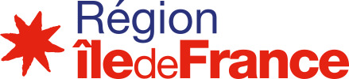

Le projet **NeuroViz** a pour objectif de mieux comprendre le
fonctionnement des réseaux de neurones au cœur des systèmes de
traduction automatique de l’état de l’art. Associant deux laboratoire
d’informatique et deux laboratoire de linguistique, ce projet propose
une approche originale reposant sur l’utilisation de connaissances en
traductologie pour *analyser* de manière qualitative les effets de
structures linguistiques et des représentations neuronales sur la
qualité des traductions prédites et *expliquer*, dans une certaine
mesure, le « raisonnement » permettant d’obtenir celles-ci.

# Réalisations

# Description du projet

## Actualité et enjeux

Les systèmes de traduction neuronaux ont permis d’améliorer
significativement la qualité de la traduction automatique (TA) et
celle-ci est de plus en plus utilisée. La TA continue toutefois d’être
entachée d’erreurs et de contresens pouvant être lourds de
conséquences comme lorsque [le nom du président chinois a été
transformé en « Mr Shithole
»](https://www.theguardian.com/technology/2020/jan/18/facebook-xi-jinping-mr-shithole)
dans la traduction automatique d’une déclaration officielle du
porte-parole du gouvernement birman. Nous pensons qu’une compréhension
fine du fonctionnement d’un système de traduction neuronal (ici,
l’absence de détection d’une entité nommée) est nécessaire pour
*expliquer* les prédictions de celui-ci et permettre d’améliorer encore
la qualité de la TA en évitant ce type d’erreur. Nous proposons pour
cela une approche originale consistant à étudier le comportement des
systèmes de TA sur des exemples choisis spécifiquement selon certaines
propriétés linguistiques.  Nous nous appuierons pour cela sur trois
types de techniques :

- des **sondes linguistiques**, comme celles conçues par [[Linzen et
  al., 2016]](https://www.aclweb.org/anthology/Q16-1037/), qui
  définissent des tâches de classification permettant de savoir si les
  représentations construites automatiquement par les réseaux de
  neurones sont capables de prédire certaines propriétés
  linguistiques. À notre connaissance, ce type de méthodes n’a pas
  encore été utilisé dans un contexte multilingue ou pour des couples
  de langues impliquant le français ;

- des **annotations automatiques de textes** : nous utiliserons des
  métriques de complexité lexicale, de lisibilité, de complexité
  syntaxique [[Sousa et
  al. 2020]](https://www.aclweb.org/anthology/2020.iwltp-1.17/)] et des
  annotations sémantiques pour mieux contrôler les types de pertes
  dans la traduction neuronale ;

- des **techniques de visualisation** des différents niveaux
  d’activation comme celle mises en œuvre par [[Montavon et al.,
  2018]](https://www.sciencedirect.com/science/article/pii/S1051200417302385)
  pour la classification d’images. En s’appuyant sur des outils comme
  [seq2seq-Vis](https://seq2seq-vis.io/) ou
  [NeuroX](https://arxiv.org/abs/1812.09359), nous essayerons en
  comparant les activations des neurones en fonction des propriétés
  linguistiques des énoncés à traduire, de comprendre comment
  s’effectue la division du travail dans la traduction neuronale et de
  dresser une cartographie de l’activation des réseaux de neurones en
  fonction des propriétés linguistique et des types de tâches.

## Partenaires

- [Guillaume Wisniewski](https://gw17.github.io/) ([LLF](http://www.llf.cnrs.fr/))
- [François Yvon](https://perso.limsi.fr/yvon/mysite/mysite.php) ([LIMSI](https://www.limsi.fr/fr/))
- J.-B. Yunès (IRIF)
- [N. Ballier](http://www.clillac-arp.univ-paris-diderot.fr/user/nicolas_ballier) ([CLILLAC-ARP](http://www.clillac-arp.univ-paris-diderot.fr/index))

## Financement

Le projet Neuroviz est soutenu par la Région Ile-de-France dans le cadre d'un financement DIM RFSI 2020
